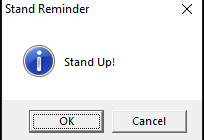

# sit-stand
A simple configurable sit-stand reminder script for Windows that runs in your systray. My main purpose in writing this script was to learn more about PowerShell programming, but it has the added benefit of getting you to stand up regularly!

# execution
You can either run this as PS1 from Windows PowerShell or use the compiled EXE version.

# syntax
```
> sit-stand.exe
or
> powershell -file sit-stand.ps1
[options below, all options are, in fact, optional]
-sit [#] Time to sit before being remanded to stand in minutes (default 60)
-stand [#] Time to stand before being remanded to sit in minutes (default 60)
-font [font-name] typeface in systray (default calibri)
-fg [color] foreground color in systray (default white)
-bg [color] background color in systray (default darkblue)
-auto start automatically on login (default off)
-uninstall remove all traces of application
-help Display help message
```
# tips
You may want to set the systray icon to "always show" in your taskbar settings so you can see the sit/stand countdown.

# license
MIT

# suggestions/bug reports
are welcome.

This has only been tested on Windows 10 and Windows PowerShell 5.1.

# screenshots




